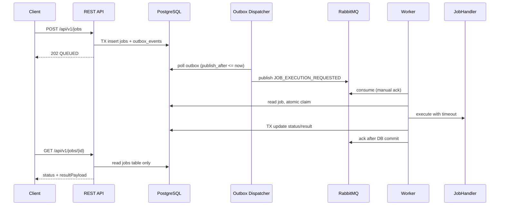
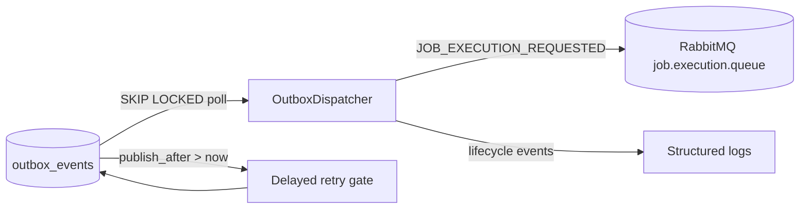
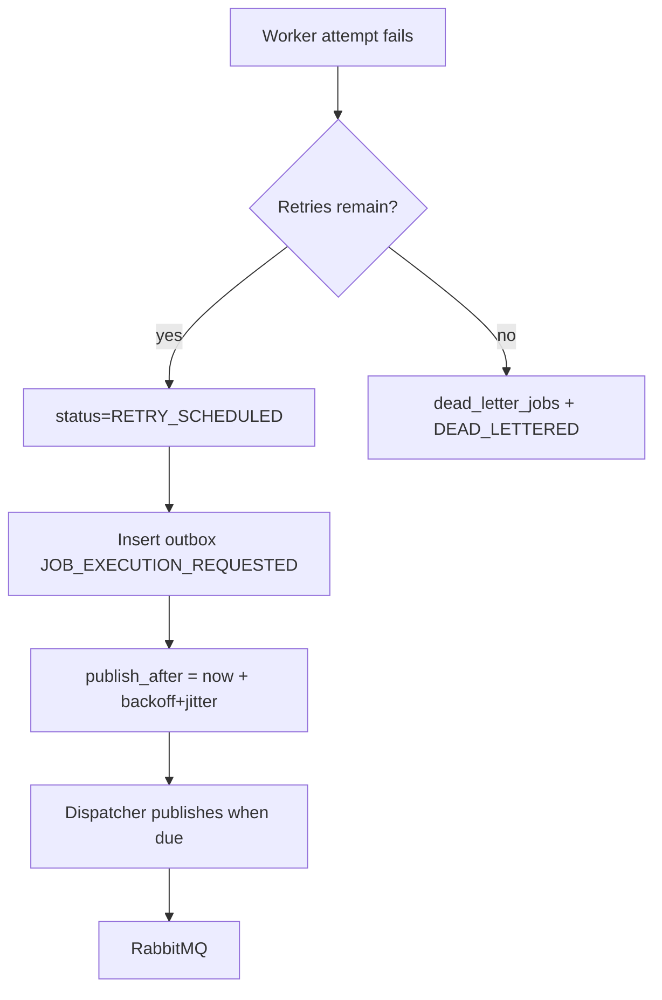
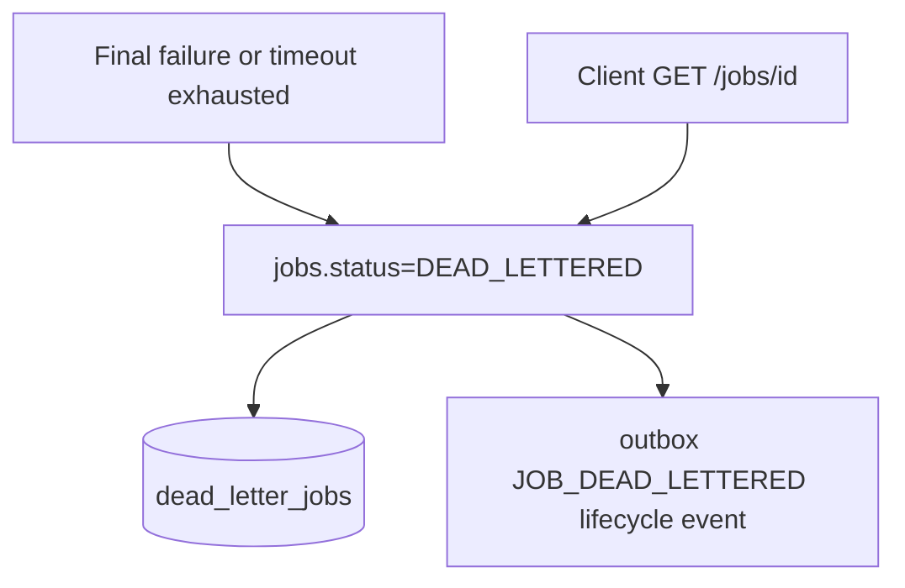
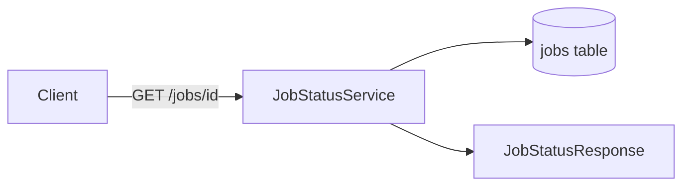
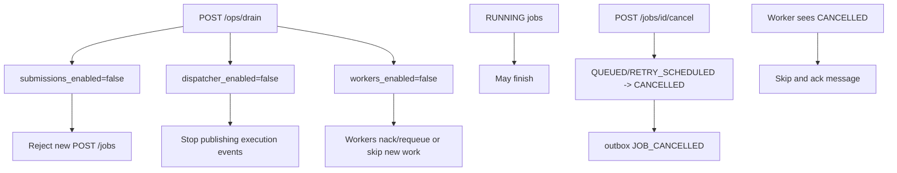

# Architecture

## Component responsibilities

| Component | Responsibility |
|-----------|----------------|
| REST API | Accept jobs, expose status/queue depth, drain/resume/cancel |
| PostgreSQL `jobs` | Source of truth for client-visible status and results |
| PostgreSQL `outbox_events` | Reliable bridge for publishing execution/lifecycle events |
| Outbox Dispatcher | Polls outbox, publishes `JOB_EXECUTION_REQUESTED` to RabbitMQ |
| RabbitMQ | Priority execution queue consumed by workers |
| Workers | Claim jobs atomically, execute handlers, update status |
| `dead_letter_jobs` | Audit trail for exhausted retries |

## Full lifecycle (HTTP → result)

## Outbox dispatcher path

## Retry path

## Dead letter path

## Status API path

Status API never reads RabbitMQ or outbox.

## Drain and cancel

## At-least-once semantics

| Stage | Guarantee | Duplicate scenario | Bound |
|-------|-----------|-------------------|-------|
| API → DB | Exactly-once insert per idempotencyKey | Duplicate POST with same key | Returns same jobId |
| Outbox → RabbitMQ | At-least-once publish | Dispatcher retry / crash | jobId + terminal status check |
| RabbitMQ → Worker | At-least-once delivery | Redelivery after nack/crash | Atomic claim + terminal skip |
| Handler execution | At-least-once | Redelivered message | Claim SQL + status checks |

We do **not** claim exactly-once execution. External side effects inside handlers must be idempotent.

## Why not a `job_queue` table?

Polling DB rows for execution couples throughput to DB polling and makes priority/delayed retry harder. RabbitMQ provides mature consumer scaling and priority queues.

## Why not read status from RabbitMQ?

Broker message state is ephemeral and not authoritative for business lifecycle. Clients need durable queryable status independent of broker retention.

## Duplicate execution bounds

- `jobId` identity
- Optional `idempotencyKey` on submission
- Atomic claim SQL with lease (`JobRepository.claimJob`, `JobExecutionService.tryClaim`)
- Skip if status is terminal/cancelled

## Priority

Queue declared with `x-max-priority=10`. Message priority set from request. This is practical broker priority, not global strict ordering.

## Delayed retry

Failed attempts create outbox events with future `publish_after` using exponential backoff + jitter. Workers do not sleep; dispatcher time-gates publishing.

## Failure scenarios

| Scenario | Behavior |
|----------|----------|
| API crash after DB commit | Outbox dispatcher eventually publishes |
| Dispatcher crash mid-batch | SKIP LOCKED + status transitions allow retry |
| Worker crash after claim | Lease expires; message may be redelivered; claim prevents double-run if completed |
| RabbitMQ unavailable | Outbox events remain pending/failed and retry |
| Duplicate delivery | Terminal status + claim SQL skip re-execution |

## Tradeoffs

- Additional dispatcher component vs simpler direct publish
- Operational complexity of RabbitMQ vs DB polling
- At-least-once semantics require idempotent handlers
