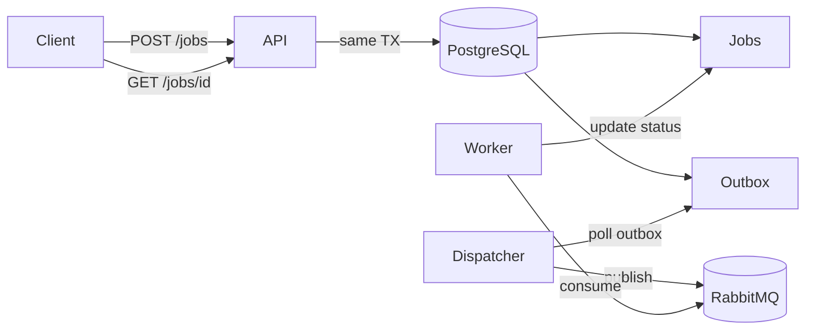

# Async Job Processing Service

Production-ready async job processing platform using Spring Boot, PostgreSQL transactional outbox, and RabbitMQ priority execution queue.

## Architecture



## Why this design

- **RabbitMQ** is the execution queue for scalable worker consumption and priority routing.
- **PostgreSQL** is the source of truth for client-visible job status and results.
- **Transactional outbox** ensures execution events are published reliably without dual-write problems.
- **At-least-once execution** with idempotency keys, atomic claims, and terminal status checks bounds duplicate work.

## Quick start

```bash
cp .env.example .env
make local-up
make test
make integration-test
make smoke-test
```

## API examples

```bash
curl -X POST http://localhost:8080/api/v1/jobs \
  -H 'Content-Type: application/json' \
  -d '{"payload":{"type":"success"},"priority":5,"maxRetries":3,"timeoutSeconds":10}'

curl http://localhost:8080/api/v1/jobs/{jobId}
curl http://localhost:8080/api/v1/queue/depth
curl -X POST http://localhost:8080/api/v1/jobs/{jobId}/cancel
curl -X POST http://localhost:8080/api/v1/ops/drain
curl -X POST http://localhost:8080/api/v1/ops/resume
```

See [docs/api-examples.md](docs/api-examples.md) for more.

## Deployment (DigitalOcean)

```bash
export DIGITALOCEAN_ACCESS_TOKEN=...
cp infra/terraform/terraform.tfvars.example infra/terraform/terraform.tfvars
./scripts/do/provision.sh
./scripts/do/deploy.sh
./scripts/do/smoke-test-prod.sh
```

## GitHub Actions secrets

- `DIGITALOCEAN_ACCESS_TOKEN`
- `SSH_PRIVATE_KEY`, `SSH_PUBLIC_KEY`
- `PROD_DATABASE_URL`, `PROD_DATABASE_USERNAME`, `PROD_DATABASE_PASSWORD`
- `PROD_RABBITMQ_HOST`, `PROD_RABBITMQ_USERNAME`, `PROD_RABBITMQ_PASSWORD`

## Roles

Single Docker image supports `APP_ROLE=api|worker|dispatcher|all` via environment variables.

## Documentation

- [ARCHITECTURE.md](ARCHITECTURE.md)
- [RUNBOOK.md](RUNBOOK.md)
- [DEPLOYMENT.md](DEPLOYMENT.md)
- [TESTING.md](TESTING.md)

## Limitations

- No exactly-once execution; handlers must be idempotent for external side effects.
- Global ordering is not guaranteed; only RabbitMQ priority within queue.
- RUNNING job cancellation is best effort.
- RabbitMQ management metrics are optional.

## Future improvements

- Per-tenant ordering keys and dedicated queues
- Kafka lifecycle event sink
- Admin UI for dead letter replay
- Autoscaling workers from queue depth metrics
