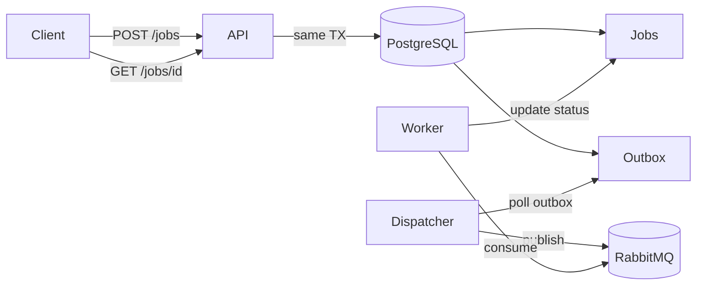

# Async Job Processing Service

Production-ready async job processing platform using Spring Boot, PostgreSQL transactional outbox, and RabbitMQ priority execution queue.

## Architecture



See [ARCHITECTURE.md](ARCHITECTURE.md) for retry, dead-letter, drain, cancel, and outbox paths.

## Why this design

- **RabbitMQ** is the execution queue for scalable worker consumption and priority routing.
- **PostgreSQL** is the source of truth for client-visible job status and results.
- **Transactional outbox** ensures execution events are published reliably without dual-write problems.
- **At-least-once execution** with idempotency keys, atomic claims, and terminal status checks bounds duplicate work.

## Local setup

```bash
cp .env.example .env
make local-up
make test
make integration-test
make smoke-test
make local-down
```

## Docker Compose

Runs `postgres:16`, `rabbitmq:3-management`, `api`, `worker`, `dispatcher` as separate containers from one image.

```bash
make local-up    # start stack
make logs        # tail logs
make smoke-test  # end-to-end curl script
make local-down  # stop stack
```

## Worker configuration

| Variable | Default | Description |
|----------|---------|-------------|
| `APP_ROLE` | all | `api`, `worker`, `dispatcher`, or `all` |
| `WORKER_ENABLED` | true | Enable RabbitMQ consumer |
| `WORKER_CONCURRENCY` | 4 | Handler thread pool size |
| `WORKER_LEASE_SECONDS` | 60 | Claim lease duration |
| `WORKER_ID_PREFIX` | worker | Prefix for worker identity in logs |

## Retry configuration

| Variable | Default | Description |
|----------|---------|-------------|
| `BACKOFF_BASE_MS` | 1000 | Exponential backoff base |
| `BACKOFF_MAX_MS` | 60000 | Backoff cap |
| `BACKOFF_JITTER_MS` | 500 | Random jitter added to backoff |

Retries use `outbox_events.publish_after`; workers do not sleep between retries.

## Timeout behavior

Each job specifies `timeoutSeconds` (1–300). The worker runs the handler on a thread pool and cancels on timeout, marking the attempt as `TIMEOUT`. External side effects still require idempotent handlers.

## Queue depth

```bash
curl http://localhost:8080/api/v1/queue/depth
```

Returns DB counts always. RabbitMQ ready/unacked counts appear when `RABBITMQ_MANAGEMENT_URL` is configured.

## Drain and resume

```bash
curl -X POST http://localhost:8080/api/v1/ops/drain
curl -X POST http://localhost:8080/api/v1/ops/resume
```

Drain stops submissions, dispatcher publishing, and workers starting new jobs. Running jobs may finish. Status APIs keep working.

## Cancel

```bash
curl -X POST http://localhost:8080/api/v1/jobs/{jobId}/cancel
```

Only `QUEUED` and `RETRY_SCHEDULED` jobs can be cancelled via API. Workers skip cancelled jobs and ack the message.

## Status API

```bash
curl http://localhost:8080/api/v1/jobs/{jobId}
```

Reads `jobs` table only — never RabbitMQ or outbox.

## Handling high load

- Scale worker containers: `make scale-local WORKERS=5` or set `WORKERS=2` in `make local-up`
- Per-container consumers: `WORKER_CONCURRENCY` (RabbitMQ listener threads)
- Multiple worker droplets: Terraform `worker_count` or `./scripts/do/scale-workers.sh N`
- RabbitMQ priority queue (`x-max-priority=10`)
- Outbox dispatcher batch polling with `SKIP LOCKED` for multiple dispatcher instances
- API returns 202 immediately; execution is fully asynchronous

See [docs/workers.md](docs/workers.md) for worker architecture and deploy verification.

## At-least-once semantics

- Outbox + RabbitMQ + manual ack provide at-least-once delivery
- Duplicate execution bounded by `jobId`, `idempotencyKey`, atomic claim SQL, terminal status checks
- Handlers with external side effects must be idempotent

## GitHub Actions

| Workflow | Trigger | Purpose |
|----------|---------|---------|
| `ci.yml` | push, PR | Unit + integration tests, Docker build |
| `docker-build.yml` | push to main | Push image to GHCR |
| `deploy.yml` | manual | Deploy to DigitalOcean + smoke test |

### Required secrets

- `DIGITALOCEAN_ACCESS_TOKEN`
- `SSH_PRIVATE_KEY`, `SSH_PUBLIC_KEY`
- `PROD_DATABASE_URL`, `PROD_DATABASE_USERNAME`, `PROD_DATABASE_PASSWORD`
- `PROD_RABBITMQ_HOST`, `PROD_RABBITMQ_USERNAME`, `PROD_RABBITMQ_PASSWORD`

## DigitalOcean deployment

```bash
export DIGITALOCEAN_ACCESS_TOKEN=...
cp infra/terraform/terraform.tfvars.example infra/terraform/terraform.tfvars
./scripts/do/provision.sh
./scripts/do/deploy.sh
./scripts/do/smoke-test-prod.sh
```

## Smoke tests

```bash
make smoke-test              # local stack
./scripts/do/smoke-test-prod.sh  # production
```

## Observability

- `/actuator/health`, `/actuator/metrics`, `/actuator/prometheus`
- Metrics: `jobs.submitted`, `jobs.succeeded`, `jobs.failed`, `jobs.retry_scheduled`, `jobs.dead_lettered`, `worker.execution.duration`, `outbox.pending`, `outbox.published`, `outbox.failed`, `queue.depth.db`
- Structured JSON logs (prod) with `jobId` and `workerId` in MDC

## Documentation

- [ARCHITECTURE.md](ARCHITECTURE.md)
- [RUNBOOK.md](RUNBOOK.md)
- [DEPLOYMENT.md](DEPLOYMENT.md)
- [TESTING.md](TESTING.md)
- [docs/workers.md](docs/workers.md)
- [docs/api-examples.md](docs/api-examples.md)

## Limitations

- No exactly-once execution; handlers must be idempotent for external side effects.
- Global ordering is not guaranteed; only RabbitMQ priority within queue.
- RUNNING job cancellation is best effort.
- Cron/recurring scheduled jobs are not implemented (future improvement).

## Future improvements

- Per-tenant ordering keys and dedicated queues
- Kafka lifecycle event sink
- Admin UI for dead letter replay
- Autoscaling workers from queue depth metrics
